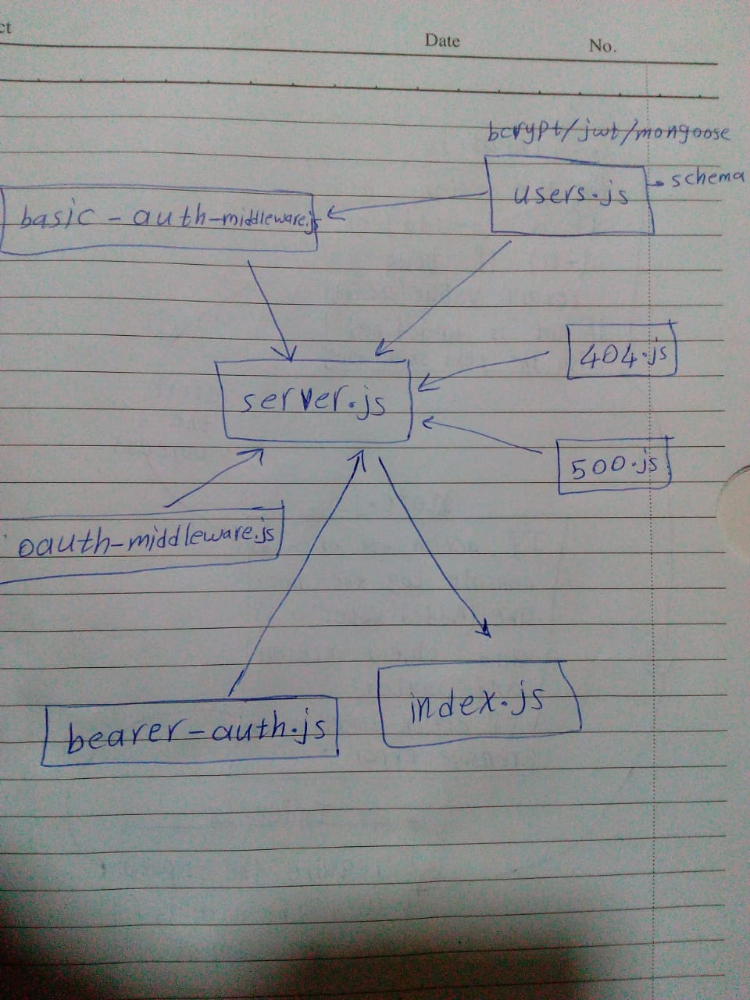

# LAB - Class 12

## Project: auth-server

### Author: Esra'a Mamoun

### Links and Resources

- [submission PR - class-11](https://github.com/EsraaMamoun-401-advanced-javascript/auth-server/pull/1)
- [submission PR - class-12](https://github.com/EsraaMamoun-401-advanced-javascript/auth-server/pull/2)
- [submission PR - class-13](https://github.com/EsraaMamoun-401-advanced-javascript/auth-server/pull/3)
- [ci/cd](https://github.com/EsraaMamoun-401-advanced-javascript/auth-server/actions) (GitHub Actions)
<!-- - [back-end server url](http://xyz.com) (when applicable) -->
<!-- - [front-end application](http://xyz.com) (when applicable) -->

### Setup

#### Routs
- http://localhost:3000/signup  ===> POST
- http://localhost:3000/signin  ===> POST
- http://localhost:3000/users   ===> GET
- http://localhost:3000/        ====Redirect to====>  http://localhost:3000/aouth   
- http://localhost:3000/secret  ===> GET

#### `.env` 
- PORT=3000
- MONGODB_URI=mongodb://localhost:27017/lab-auth
- SECRET=mysecrettokenkeyesraa
- TOKEN_SERVER=https://github.com/login/oauth/access_token
- REMOTE_API=https://api.github.com/user
- CLIENT_ID=eec574886e4a374e01a2
- CLIENT_SECRET=9dccdaa431716687516f025e0d38765cdd682373
- API_SERVER=http://localhost:3000/oauth

### Modules
- basic-auth-middleware.js
- oauth-middleware.js
- bearer-auth.js
- server.js
- users.js
- 404.js
- 500.js
<!-- - model.js -->

### Packages
- @code-fellows/supergoose
- jsonwebtoken
- superagent
- mongoose
- express
- base-64
- dotenv
- eslint
- morgan
- bcrypt
- cors
- jest

#### How to initialize/run your application (where applicable)

- `node index.js`
- `npm run start-dev`

<!-- #### How to use your library (where applicable)
- Lint Tests: `npm run lint` -->

#### Tests

* How do you run tests?
 > - Jest test: `npm test` 
 > - console.log
<!-- - Any tests of note?
- Describe any tests that you did not complete, skipped, etc -->

#### UML
